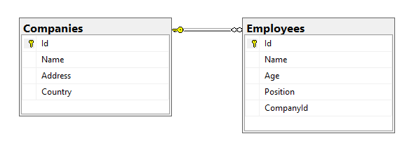
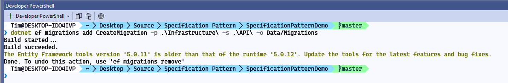
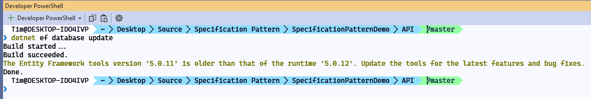
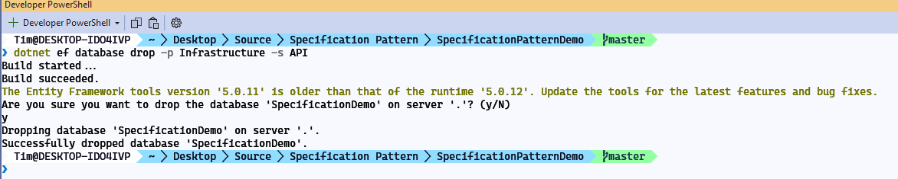
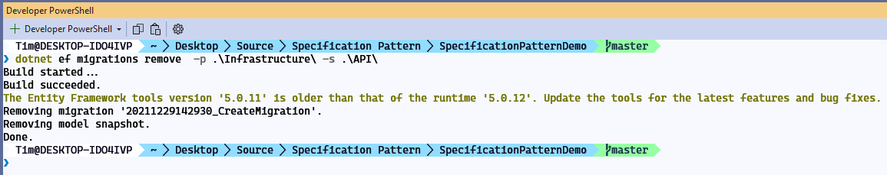
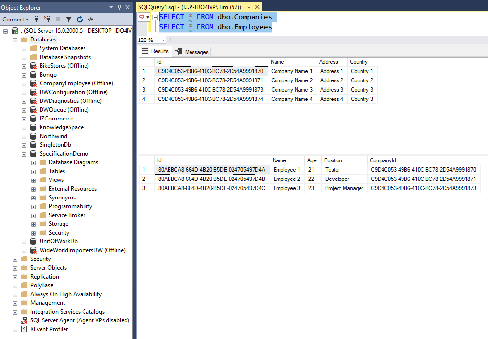

# Appling the Specification pattern and Geneneric repository in ASP.NET Core

## 1. Preparing

### 1.1 Database relationship



### 1.2 Adding the entities

**BaseEntity**

Tất cả các entities khác điều sẽ được thừa kế từ **BaseEntity** để có được property **Id**.

```c#
public class BaseEntity
{
    public Guid Id { get; set; }
}
```

**Company**

```c#
public class Company : BaseEntity
{
    public string Name { get; set; }

    public string Address { get; set; }

    public string Country { get; set; }

    public ICollection<Employee> Employees { get; set; }
}
```

**Employee**

```c#
public class Employee : BaseEntity
{
    public string Name { get; set; }

    public int Age { get; set; }
    public string Position { get; set; }

    [ForeignKey(nameof(Company))]
    public Guid CompanyId { get; set; }
    public Company Company { get; set; }
}
```

### 1.3 Adding the connection string

Trong file **appsettings.Development.json** thêm vào section sau:

```json
 "ConnectionStrings": {
    "DefaultConnection": "Data Source=.;Initial Catalog=SpecificationDemo;Integrated Security=True;MultipleActiveResultSets=True"
  }
```

Trong solution **Infrastructure** thêm vào static class `ServiceExtension` như sau:

```c#
public static class ServiceExtension
{
    public static void ConfigureSqlContext(this IServiceCollection services, IConfiguration configuration)
    {
        services.AddDbContext<ApplicationDbContext>(opt
            => opt.UseSqlServer(configuration.GetConnectionString("DefaultConnection"), b => b.MigrationsAssembly("Infrastructure")));
    }
}
```

Trong class `StartUp.cs` của  solution **API** thêm vào một service `services.AddApplicationServices();` như sau:

```c#
public void ConfigureServices(IServiceCollection services)
{

    services.AddControllers();
    services.ConfigureSqlContext(Configuration);
    services.AddApplicationServices();
    services.AddSwaggerGen(c =>
    {
        c.SwaggerDoc("v1", new OpenApiInfo { Title = "API", Version = "v1" });
    });
}
```

### 1.4 Adding the seeding data

Trong solution **Infrastructure**, tạo mới folder **SeedData** trong folder **Data**

Seeding cho **Company**

```c#
public class CompanyConfiguration : IEntityTypeConfiguration<Company>
{
    public void Configure(EntityTypeBuilder<Company> builder)
    {
        builder.HasData(
            new Company
            {
                Id = new Guid("c9d4c053-49b6-410c-bc78-2d54a9991870"),
                Name = "Company Name 1",
                Address = "Address 1",
                Country = "Country 1"
            },
            new Company
            {
                Id = new Guid("c9d4c053-49b6-410c-bc78-2d54a9991871"),
                Name = "Company Name 2",
                Address = "Address 2",
                Country = "Country 2"
            },
            new Company
            {
                Id = new Guid("c9d4c053-49b6-410c-bc78-2d54a9991873"),
                Name = "Company Name 3",
                Address = "Address 3",
                Country = "Country 3"
            },
            new Company
            {
                Id = new Guid("c9d4c053-49b6-410c-bc78-2d54a9991874"),
                Name = "Company Name 4",
                Address = "Address 4",
                Country = "Country 3"
            });
    }
}
```

Seeding cho **Employee**

```c#
public class EmployeeConfiguration : IEntityTypeConfiguration<Employee>
{
    public void Configure(EntityTypeBuilder<Employee> builder)
    {
        builder.HasData(
            new Employee
            {
                Id = new Guid("80abbca8-664d-4b20-b5de-024705497d4a"),
                Name = "Employee 1",
                Age = 21,
                Position = "Tester",
                CompanyId = new Guid("c9d4c053-49b6-410c-bc78-2d54a9991870")
            },
            new Employee
            {
                Id = new Guid("80abbca8-664d-4b20-b5de-024705497d4b"),
                Name = "Employee 2",
                Age = 22,
                Position = "Developer",
                CompanyId = new Guid("c9d4c053-49b6-410c-bc78-2d54a9991871")
            },
            new Employee
            {
                Id = new Guid("80abbca8-664d-4b20-b5de-024705497d4c"),
                Name = "Employee 3",
                Age = 23,
                Position = "Project Manager",
                CompanyId = new Guid("c9d4c053-49b6-410c-bc78-2d54a9991873")
            });
    }
}
```

### 1.5 Create **DbContext**

Trong folder **Data** của solution **Infrastructure**, ta tạo class `ApplicationDbContext` như sau:

```c#
public class ApplicationDbContext : DbContext
{
    public ApplicationDbContext(DbContextOptions<ApplicationDbContext> options) : base(options)
    {
    }

    // Configuring to seed data.
    protected override void OnModelCreating(ModelBuilder modelBuilder)
    {
        modelBuilder.ApplyConfiguration(new CompanyConfiguration());
        modelBuilder.ApplyConfiguration(new EmployeeConfiguration());
    }
    // Adding the application's entities below
    public DbSet<Company> Companies { get; set; }
    public DbSet<Employee> Employees { get; }
}
```

### 1.6 Add migrations

Đứng tại vị trí của thư mục gốc của project ta thực hiện lệnh sau để add migrations
Trong trường hợp này:
- Connection string được đặt ở solution **API**
- Các entity được nằm 

```
dotnet ef migrations add CreateMigration -p .\Infrastructure\ -s .\API\ -o Data/Migrations

```



Trức khi thực hiện apply change xuống database ta nên kiểm tra lại các file được generated khi ta thực hiện việc add migration bên trên.

Để apply các migration xuống database ta thực hiện lệnh sau

```
dotnet ef database update
```


Để remove migrations, trước tiên ta cần drop database như sau:

Từ thư mục gốc của project, thực hiện lệnh sau: 

```
dotnet ef database drop -p Infrastructure -s API
```



Sau đó ta thực hiện remove migrations

```
dotnet ef migrations remove  -p .\Infrastructure\ -s .\API\

```



Khi add migration và apply xuống DB thành công ta sẽ được kết quả như sau:



### 1.7 Adding the DTOs

Trong solution **API** ta thêm folder tên là **Dtos** và thêm vào 2 classes sau:
**Dto** là object mà ta sẽ trả về cho client thay vì ta dùng các entity của domain.

**CompanyToReturnDto**

```c#
public class CompanyToReturnDto
{
    public Guid Id { get; set; }

    public string Name { get; set; }

    public string Address { get; set; }

    public string Country { get; set; }

    public ICollection<EmployeeToReturnDto> Employees { get; set; }

}
```

**EmployeeToReturnDto**

```c#
public class EmployeeToReturnDto
{
    public Guid Id { get; set; }

    public string Name { get; set; }

    public int Age { get; set; }

    public string Position { get; set; }

    public string CompanyName { get; set; }
}
```

### 1.8 Adding Automapper

Trong solution **API** ta thêm vào nuget `AutoMapper.Extensions.Microsoft.DependencyInjection`

Trong solution **API** ta tạo mới một folder tên là **Helpers** với class **MappingProfiles**, class này sẽ giúp ta thực hiện chỉ định việc mapping các entities với Auto mapper.

```c#
public class MappingProfiles : Profile
{
    public MappingProfiles()
    {
        CreateMap<Employee, EmployeeToReturnDto>()
            .ForMember(d => d.Id, o => o.MapFrom(e => e.Id))
            .ForMember(d => d.Name, o => o.MapFrom(e => e.Name))
            .ForMember(d => d.Position, o => o.MapFrom(e => e.Position))
            .ForMember(d => d.Age, o => o.MapFrom(e => e.Age))
            .ForMember(d => d.CompanyName, o => o.MapFrom(e => e.Company.Name));

        CreateMap<Company, CompanyToReturnDto>();
    }
}
```

Trong method **ConfigureServices** của **Startup.cs** ta thực hiện đăng ký service cho việc mapping như sau:

```c#
 services.AddAutoMapper(typeof(MappingProfiles));
```

## 2. Apply the Generic repository and the specification pattern
