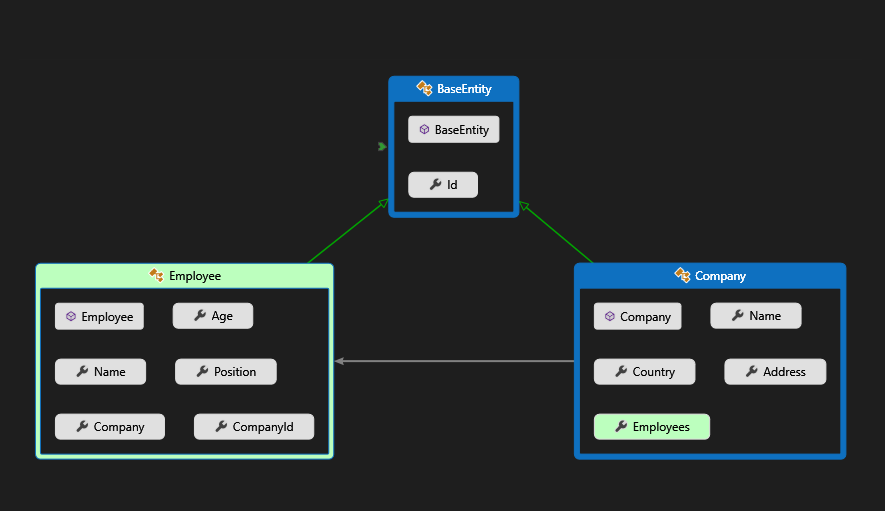
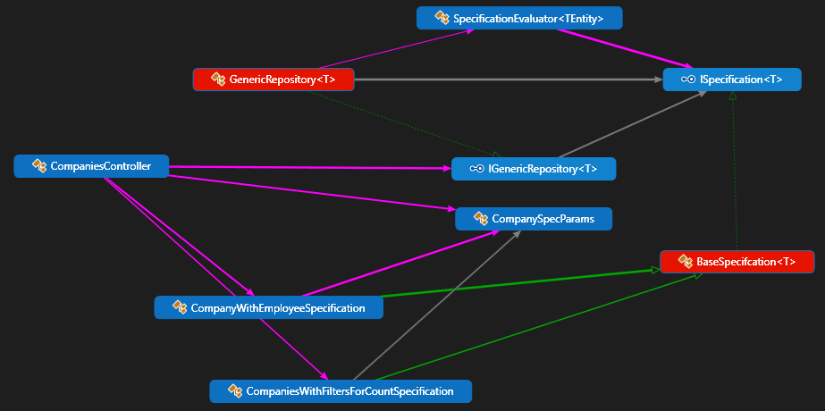

# Appling the Specification pattern and Geneneric repository in ASP.NET Core

## 1. Preparing

### 1.1 Database relationship


### 1.2 Adding the entities

**BaseEntity**

Tất cả các entities khác điều sẽ được thừa kế từ **BaseEntity** để có được property **Id**.



```c#
public class BaseEntity
{
    public Guid Id { get; set; }
}
```

**Company**

```c#
public class Company : BaseEntity
{
    public string Name { get; set; }

    public string Address { get; set; }

    public string Country { get; set; }

    public ICollection<Employee> Employees { get; set; }
}
```

**Employee**

```c#
public class Employee : BaseEntity
{
    public string Name { get; set; }

    public int Age { get; set; }
    public string Position { get; set; }

    [ForeignKey(nameof(Company))]
    public Guid CompanyId { get; set; }
    public Company Company { get; set; }
}
```

### 1.3 Adding the connection string

Trong file **appsettings.Development.json** thêm vào section sau:

```json
 "ConnectionStrings": {
    "DefaultConnection": "Data Source=.;Initial Catalog=SpecificationDemo;Integrated Security=True;MultipleActiveResultSets=True"
  }
```

Trong solution **Infrastructure** thêm vào static class `ServiceExtension` như sau:

```c#
public static class ServiceExtension
{
    public static void ConfigureSqlContext(this IServiceCollection services, IConfiguration configuration)
    {
        services.AddDbContext<ApplicationDbContext>(opt
            => opt.UseSqlServer(configuration.GetConnectionString("DefaultConnection"), b => b.MigrationsAssembly("Infrastructure")));
    }
}
```

Trong class `StartUp.cs` của  solution **API** thêm vào một service `services.AddApplicationServices();` như sau:

```c#
public void ConfigureServices(IServiceCollection services)
{

    services.AddControllers();
    services.ConfigureSqlContext(Configuration);
    services.AddApplicationServices();
    services.AddSwaggerGen(c =>
    {
        c.SwaggerDoc("v1", new OpenApiInfo { Title = "API", Version = "v1" });
    });
}
```

### 1.4 Adding the seeding data

Trong solution **Infrastructure**, tạo mới folder **SeedData** trong folder **Data**

Seeding cho **Company**

```c#
public class CompanyConfiguration : IEntityTypeConfiguration<Company>
{
    public void Configure(EntityTypeBuilder<Company> builder)
    {
        builder.HasData(
            new Company
            {
                Id = new Guid("c9d4c053-49b6-410c-bc78-2d54a9991870"),
                Name = "Company Name 1",
                Address = "Address 1",
                Country = "Country 1"
            },
            new Company
            {
                Id = new Guid("c9d4c053-49b6-410c-bc78-2d54a9991871"),
                Name = "Company Name 2",
                Address = "Address 2",
                Country = "Country 2"
            },
            new Company
            {
                Id = new Guid("c9d4c053-49b6-410c-bc78-2d54a9991873"),
                Name = "Company Name 3",
                Address = "Address 3",
                Country = "Country 3"
            },
            new Company
            {
                Id = new Guid("c9d4c053-49b6-410c-bc78-2d54a9991874"),
                Name = "Company Name 4",
                Address = "Address 4",
                Country = "Country 3"
            });
    }
}
```

Seeding cho **Employee**

```c#
public class EmployeeConfiguration : IEntityTypeConfiguration<Employee>
{
    public void Configure(EntityTypeBuilder<Employee> builder)
    {
        builder.HasData(
            new Employee
            {
                Id = new Guid("80abbca8-664d-4b20-b5de-024705497d4a"),
                Name = "Employee 1",
                Age = 21,
                Position = "Tester",
                CompanyId = new Guid("c9d4c053-49b6-410c-bc78-2d54a9991870")
            },
            new Employee
            {
                Id = new Guid("80abbca8-664d-4b20-b5de-024705497d4b"),
                Name = "Employee 2",
                Age = 22,
                Position = "Developer",
                CompanyId = new Guid("c9d4c053-49b6-410c-bc78-2d54a9991871")
            },
            new Employee
            {
                Id = new Guid("80abbca8-664d-4b20-b5de-024705497d4c"),
                Name = "Employee 3",
                Age = 23,
                Position = "Project Manager",
                CompanyId = new Guid("c9d4c053-49b6-410c-bc78-2d54a9991873")
            });
    }
}
```

### 1.5 Create **DbContext**

Trong folder **Data** của solution **Infrastructure**, ta tạo class `ApplicationDbContext` như sau:

```c#
public class ApplicationDbContext : DbContext
{
    public ApplicationDbContext(DbContextOptions<ApplicationDbContext> options) : base(options)
    {
    }

    // Configuring to seed data.
    protected override void OnModelCreating(ModelBuilder modelBuilder)
    {
        modelBuilder.ApplyConfiguration(new CompanyConfiguration());
        modelBuilder.ApplyConfiguration(new EmployeeConfiguration());
    }
    // Adding the application's entities below
    public DbSet<Company> Companies { get; set; }
    public DbSet<Employee> Employees { get; }
}
```

### 1.6 Add migrations

Đứng tại vị trí của thư mục gốc của project ta thực hiện lệnh sau để add migrations
Trong trường hợp này:
- Connection string được đặt ở solution **API**
- Các entity được nằm 

```
dotnet ef migrations add CreateMigration -p .\Infrastructure\ -s .\API\ -o Data/Migrations

```


Trức khi thực hiện apply change xuống database ta nên kiểm tra lại các file được generated khi ta thực hiện việc add migration bên trên.

Để apply các migration xuống database ta thực hiện lệnh sau

```
dotnet ef database update
```


Để remove migrations, trước tiên ta cần drop database như sau:

Từ thư mục gốc của project, thực hiện lệnh sau: 

```
dotnet ef database drop -p Infrastructure -s API
```


Sau đó ta thực hiện remove migrations

```
dotnet ef migrations remove  -p .\Infrastructure\ -s .\API\

```


Khi add migration và apply xuống DB thành công ta sẽ được kết quả như sau:


### 1.7 Adding the DTOs

Trong solution **API** ta thêm folder tên là **Dtos** và thêm vào 2 classes sau:
**Dto** là object mà ta sẽ trả về cho client thay vì ta dùng các entity của domain.

**CompanyToReturnDto**

```c#
public class CompanyToReturnDto
{
    public Guid Id { get; set; }

    public string Name { get; set; }

    public string Address { get; set; }

    public string Country { get; set; }

    public ICollection<EmployeeToReturnDto> Employees { get; set; }

}
```

**EmployeeToReturnDto**

```c#
public class EmployeeToReturnDto
{
    public Guid Id { get; set; }

    public string Name { get; set; }

    public int Age { get; set; }

    public string Position { get; set; }

    public string CompanyName { get; set; }
}
```

### 1.8 Adding Automapper

Trong solution **API** ta thêm vào nuget `AutoMapper.Extensions.Microsoft.DependencyInjection`

Trong solution **API** ta tạo mới một folder tên là **Helpers** với class **MappingProfiles**, class này sẽ giúp ta thực hiện chỉ định việc mapping các entities với Auto mapper.

```c#
public class MappingProfiles : Profile
{
    public MappingProfiles()
    {
        CreateMap<Employee, EmployeeToReturnDto>()
            .ForMember(d => d.Id, o => o.MapFrom(e => e.Id))
            .ForMember(d => d.Name, o => o.MapFrom(e => e.Name))
            .ForMember(d => d.Position, o => o.MapFrom(e => e.Position))
            .ForMember(d => d.Age, o => o.MapFrom(e => e.Age))
            .ForMember(d => d.CompanyName, o => o.MapFrom(e => e.Company.Name));

        CreateMap<Company, CompanyToReturnDto>();
    }
}
```

### 1.9 Adding Helper classes.

Trong thư mục **Helpers** của project **API** ta thêm vào class `Pagination` để phục vụ cho việc phân trang cho các APIs trong application.

```c#
public class Pagination<T> where T : class
{
    public Pagination(int pageIndex, int pageSize, int count, IReadOnlyList<T> data)
    {
        PageIndex = pageIndex;
        PageSize = pageSize;
        Count = count;
        Data = data;
    }

    public int PageIndex { get; set; }
    public int PageSize { get; set; }
    public int Count { get; set; }
    public IReadOnlyList<T> Data { get; set; }
}
```

Trong method **ConfigureServices** của **Startup.cs** ta thực hiện đăng ký service cho việc mapping như sau:

```c#
 services.AddAutoMapper(typeof(MappingProfiles));
```

## 2. Apply the Generic repository and the specification pattern

### 2.1 Introduction Specification Pattern



### 2.2 Create Core members of the Specification Pattern

Trong project **Core** tạo interface `ISpecification` trong thư mục **Specifications** 

**2.2.1 ISpecification**

```c#
public interface ISpecification<T>
{
    Expression<Func<T, bool>> Criteria { get; }

    List<Expression<Func<T, object>>> Includes { get; }

    Expression<Func<T, object>> OrderBy { get; }

    Expression<Func<T, object>> OrderByDescending { get; }

    int Take { get; }

    int Skip { get; }

    bool IsPagingEnabled { get; }
}
```
**2.2.2 BaseSpecifcation**

Trong thư mục **Specifications** tạo tiếp class **BaseSpecifcation**

```c#
public class BaseSpecifcation<T> : ISpecification<T>
{
    public BaseSpecifcation()
    {
    }

    public BaseSpecifcation(Expression<Func<T, bool>> criteria)
    {
        Criteria = criteria;
    }

    public Expression<Func<T, bool>> Criteria { get; }

    public List<Expression<Func<T, object>>> Includes { get; } = new List<Expression<Func<T, object>>>();

    public Expression<Func<T, object>> OrderBy { get; private set; }

    public Expression<Func<T, object>> OrderByDescending { get; private set; }

    public int Take { get; private set; }

    public int Skip { get; private set; }

    public bool IsPagingEnabled { get; private set; }

    protected void AddInclude(Expression<Func<T, object>> includeExpression)
    {
        Includes.Add(includeExpression);
    }

    protected void AddOrderBy(Expression<Func<T, object>> orderByExpression)
    {
        OrderBy = orderByExpression;
    }

    protected void AddOrderByDescending(Expression<Func<T, object>> orderByDescExpression)
    {
        OrderByDescending = orderByDescExpression;
    }

    protected void ApplyPaging(int skip, int take)
    {
        Skip = skip;
        Take = take;
        IsPagingEnabled = true;
    }
}
```

**2.2.3 SpecificationEvaluator**

Trong thư mục **Data** của project **Infrastructure** ta tạo class `SpecificationEvaluator`

Ta thấy ở đây `TEntity` phải là một class kế thừ từ `BaseEntity`

```c#
public class SpecificationEvaluator<TEntity> where TEntity : BaseEntity
{
    public static IQueryable<TEntity> GetQuery(IQueryable<TEntity> inputQuery, ISpecification<TEntity> spec)
    {
        var query = inputQuery;

        if (spec.Criteria != null)
        {
            query = query.Where(spec.Criteria);
        }

        if (spec.OrderBy != null)
        {
            query = query.OrderBy(spec.OrderBy);
        }

        if (spec.OrderByDescending != null)
        {
            query = query.OrderByDescending(spec.OrderByDescending);
        }

        if (spec.IsPagingEnabled)
        {
            query = query.Skip(spec.Skip).Take(spec.Take);
        }

        query = spec.Includes.Aggregate(query, (current, include) => current.Include(include));

        return query;
    }
}
```

### 2.3 Create the generic repository and apply the Specification Pattern.

Trong **Core** project ta tạo interface `IGenericRepository` trong thư mục **Interfaces** như sau:

```c#
public interface IGenericRepository<T> where T : BaseEntity
{
    Task<T> GetByIdAsync(Guid id);

    Task<IReadOnlyList<T>> GetAllAsync();

    Task<T> GetEntityWithSpect(ISpecification<T> spec);

    Task<IReadOnlyList<T>> ListAsync(ISpecification<T> spec);

    Task<int> CountAsync(ISpecification<T> spec);

    void Add(T entity);

    void Update(T entity);

    void Delete(T entity);
}
```

Tiếp tục ta tạo `GenericRepository` implement từ interface `IGenericRepository`.

Ở đây, **T** có constrain phải là một class kế thừ từ `BaseEntity`.

```c#
public class GenericRepository<T> : IGenericRepository<T> where T : BaseEntity
{
    private readonly ApplicationDbContext _context;

    public GenericRepository(ApplicationDbContext context)
    {
        _context = context;
    }

    public async Task<int> CountAsync(ISpecification<T> spec)
    {
        return await ApplySpecification(spec).CountAsync();
    }

    public async Task<IReadOnlyList<T>> GetAllAsync()
    {
        return await _context.Set<T>().ToListAsync();
    }

    public async Task<T> GetByIdAsync(Guid id)
    {
        return await _context.Set<T>().FindAsync(id);
    }

    public async Task<T> GetEntityWithSpect(ISpecification<T> spec)
    {
        return await ApplySpecification(spec).FirstOrDefaultAsync();
    }

    public async Task<IReadOnlyList<T>> ListAsync(ISpecification<T> spec)
    {
        var query = ApplySpecification(spec);
        return await query.ToListAsync();
    }

    public void Add(T entity)
    {
        _context.Set<T>().Add(entity);
    }

    public void Update(T entity)
    {
        _context.Set<T>().Attach(entity);
        _context.Entry(entity).State = EntityState.Modified;
    }

    public void Delete(T entity)
    {
        _context.Set<T>().Remove(entity);
    }

    private IQueryable<T> ApplySpecification(ISpecification<T> spec)
    {
        return SpecificationEvaluator<T>.GetQuery(_context.Set<T>().AsQueryable(), spec);
    }
}
```

Ta thực hiện việc đăng ký DI cho `GenericRepository`và `IGenericRepository` như sau:

Trong thư mục **Extensions** trong project **Infrastructure**, ta thêm vào một method `AddApplicationServices` cho class `ServiceExtension` như sau:

```c#
public static class ServiceExtension
{
    public static void ConfigureSqlContext(this IServiceCollection services, IConfiguration configuration)
    {
        services.AddDbContext<ApplicationDbContext>(opt
            => opt.UseSqlServer(configuration.GetConnectionString("DefaultConnection"), b => b.MigrationsAssembly("Infrastructure")));
    }

    public static void AddApplicationServices(this IServiceCollection services)
    {
        services.AddScoped(typeof(IGenericRepository<>), (typeof(GenericRepository<>)));
    }
}
```

### 2.4 Apply the Specification Pattern to the Company entity.

**CompanySpecParams**

Trong thư mục **Specification** trong project **Core** ta tạo một class `CompanySpecParams`

```c#
public class CompanySpecParams
{
    private const int MaxPageSize = 50;
    public int PageIndex { get; set; } = 1;

    private int _pageSize = 2;
    public int PageSize
    {
        get => _pageSize;
        set => _pageSize = (value > MaxPageSize) ? MaxPageSize : value;
    }

    public string Sort { get; set; }
    private string _search;
    public string Search
    {
        get => _search;
        set => _search = value.ToLower();
    }
}
```

**CompaniesWithFiltersForCountSpecification**

```c#
public class CompaniesWithFiltersForCountSpecification : BaseSpecifcation<Company>
{
    public CompaniesWithFiltersForCountSpecification(CompanySpecParams companySpecParams) : base(
        x => (string.IsNullOrEmpty(companySpecParams.Search) || x.Name.ToLower().Contains(companySpecParams.Search)))
    {
    }
}
```

**CompanyWithEmployeeSpecification**

```c#
public class CompanyWithEmployeeSpecification : BaseSpecifcation<Company>
{
    public CompanyWithEmployeeSpecification(CompanySpecParams companySpecParams) : base(x =>
    (string.IsNullOrEmpty(companySpecParams.Search) || x.Name.ToLower().Contains(companySpecParams.Search)))
    {
        AddInclude(c => c.Employees);
        ApplyPaging(companySpecParams.PageSize * (companySpecParams.PageIndex - 1), companySpecParams.PageSize);

        if (!string.IsNullOrEmpty(companySpecParams.Sort))
        {
            switch (companySpecParams.Sort)
            {
                case "nameAsc":
                    AddOrderBy(c => c.Name);
                    break;
                case "nameDesc":
                    AddOrderByDescending(c => c.Name);
                    break;
                default:
                    AddOrderBy(n => n.Name);
                    break;
            }
        }
    }

    public CompanyWithEmployeeSpecification(Guid id) : base(c => c.Id == id)
    {
        AddInclude(e => e.Employees);
    }
}
```

**CompaniesController**

```c#
[ApiController]
[Route("api/companies")]
public class CompaniesController : ControllerBase
{
    private readonly IGenericRepository<Company> _companyRepository;
    private readonly IGenericRepository<Employee> _employeeRepository;
    private readonly IMapper _mapper;

    public CompaniesController(IGenericRepository<Company> companyRepo, IGenericRepository<Employee> employeeRepo, IMapper mapper)
    {
        _mapper = mapper;
        _companyRepository = companyRepo;
        _employeeRepository = employeeRepo;
    }

    [HttpGet]
    public async Task<ActionResult<IReadOnlyList<CompanyToReturnDto>>> GetCompanies([FromQuery] CompanySpecParams companyParams)
    {
        var spec = new CompanyWithEmployeeSpecification(companyParams);
        var countSpec = new CompaniesWithFiltersForCountSpecification(companyParams);

        var totalItems = await _companyRepository.CountAsync(countSpec);
        var companies = await _companyRepository.ListAsync(spec);

        var companiesToReturn = _mapper.Map<IReadOnlyList<CompanyToReturnDto>>(companies);

        return Ok(new Pagination<CompanyToReturnDto>(companyParams.PageIndex, companyParams.PageSize, totalItems, companiesToReturn));
    }

    [HttpGet("{id}")]
    public async Task<ActionResult<CompanyToReturnDto>> GetCompany(Guid id)
    {
        var spec = new CompanyWithEmployeeSpecification(id);
        var company = await _companyRepository.GetEntityWithSpect(spec);
        if (company == null) return NotFound(HttpStatusCode.NotFound);
        return _mapper.Map<CompanyToReturnDto>(company);
    }
}
```
