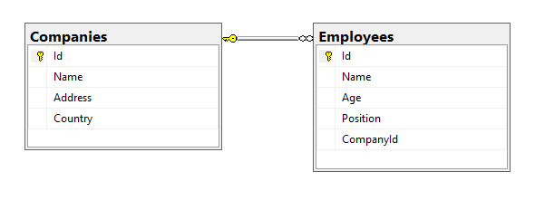

# Appling the Specification pattern and Geneneric repository in ASP.NET Core.

## 1. Introducing the simple application which used in this demo. 

### Database relationship.



### Entities

**BaseEntity**

```c#
public class BaseEntity
{
    public Guid Id { get; set; }
}
```

**Company**

```c#
public class Company : BaseEntity
{
    public string Name { get; set; }

    public string Address { get; set; }

    public string Country { get; set; }

    public ICollection<Employee> Employees { get; set; }
}
```


**Employee**

```c#
public class Employee : BaseEntity
{
    public string Name { get; set; }

    public int Age { get; set; }
    public string Position { get; set; }

    [ForeignKey(nameof(Company))]
    public Guid CompanyId { get; set; }
    public Company Company { get; set; }
}
```

## 2. Apply the Generic repository and the specification pattern in the application.


